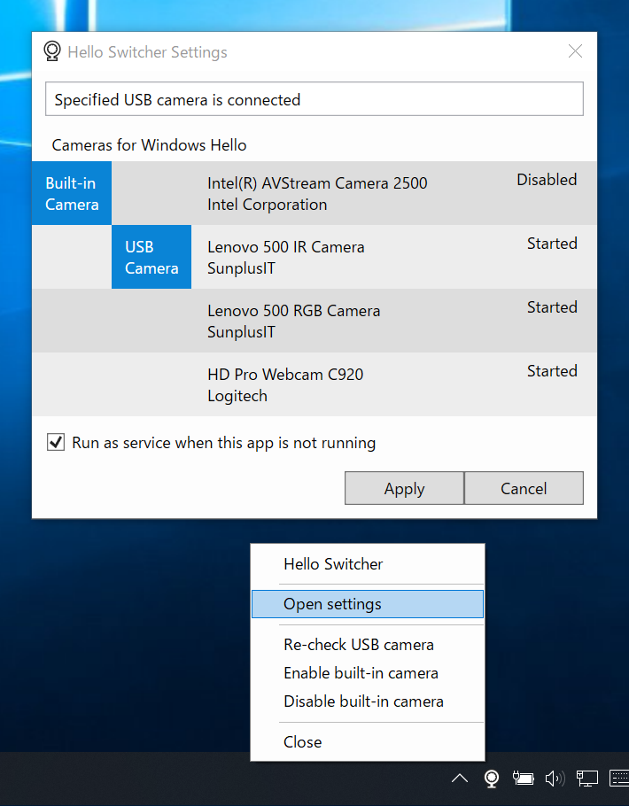

# Hello Switcher

Hello Switcher is a Windows desktop tool to help switching cameras for Windows Hello.

| NOTE |
|-|
| As of Windows 10 21H1 (19043), if both internal and external Windows Hello cameras are present, the external camera will be automatically selected. Thus this tool is no longer necessary.  See [Introducing the next feature update to Windows 10, version 21H1](https://blogs.windows.com/windowsexperience/2021/02/17/introducing-the-next-feature-update-to-windows-10-version-21h1/) |

 
(DPI: 150%)

If your PC has a built-in Windows Hello camera and you wish to add a USB camera which has Windows Hello capability* as an alternative when the built-in camera is unusable, you will not be able to switch the two cameras as you might expect. It is because Microsoft has not added the functionality to manage multiple Windows Hello cameras yet. This is a known limitation of Windows 10.

 - [Can I use an external camera when my laptop is closed or docked?](https://docs.microsoft.com/en-us/windows/security/identity-protection/hello-for-business/hello-faq#can-i-use-an-external-camera-when-my-laptop-is-closed-or-docked)

This tool is intended to help switching between a built-in camera and a USB camera for the time being.

(* USB cameras with Windows Hello capability are limited in the market: Mouse Computer CM02, Logitech Brio Webcam, Lenovo 500 FHD Webcam and so on.)

## Requirements

 * Windows 10
 * .NET Framework 4.8

This tool has to be run as administrator. 

## Download

:floppy_disk: [Latest release](https://github.com/emoacht/HelloSwitcher/releases/latest)

## How it works

This tool works as follows:

- If a specifiled USB camera is connected to the PC, this tool will __disable__ a specified built-in camera so that the USB camera is used for Windows Hello.
- If the USB camera is disconnected, this tool will __enable__ the built-in camera so that it will be used for Windows Hello again.

This tool internally calls [PnPUtil](https://docs.microsoft.com/en-us/windows-hardware/drivers/devtest/pnputil), a command-line tool which is included in the OS for managing devices, with administrator privilege to enable/disable a built-in camera.

This tool consists of ordinary app and Windows service. The former (app) has the notification icon to interact with a user and provides settings. The latter (service) runs in the background and automatically starts before sign-in of a user. This service is necessary to make sure the cameras are switched before Window Hello is used for sign-in in the case where the USB camera is connected/disconnected during the PC is turned off or suspended.

## Getting started

1. Run the installer. Start this app from the start menu. This app's icon will appear in the notification area. Right-click it to open the menu and select `Settings`.

2. In the settings window, specify a built-in camera for Windows Hello and a USB camera which you wish to use for Windows Hello. In addition, if you wish to run this tool in the background, check `Run as service when this app is not running`. Then click `Apply`. That’s all.

3. If you select not to run as service but wish to run this app (not service) from startup, register the executable file (HelloSwitcher.exe) in Task Scheduler.

    - In `Gereral`, check `Run with highest privileges`.
    - In `Conditions`, uncheck __both__ `Start the task only if the computer is on AC power` and `Stop if the computer switches to battery power`.
    - In `Settings`, uncheck `Stop the task if it runs longer than:`.

## History

Ver 1.5 2021-6-24

- Fix exception

Ver 1.4 2021-5-18

- Change context menu
- Fix settings window in specific cultures

Ver 1.3 2021-5-4

 - Add Windows service
 - Enable to install and run service

Ver 1.2 2021-4-22

 - Enable to run as service

Ver 1.1 2021-2-18

 - Change to use PnPUtil instead of DevCon
 - Add settings window

Ver 1.0 2020-6-9

 - Initial release

## License

 - MIT License

## Libraries

 - [XamlBehaviors for WPF](https://github.com/microsoft/XamlBehaviorsWpf)

## Developer

 - emoacht (emotom[atmark]pobox.com)
